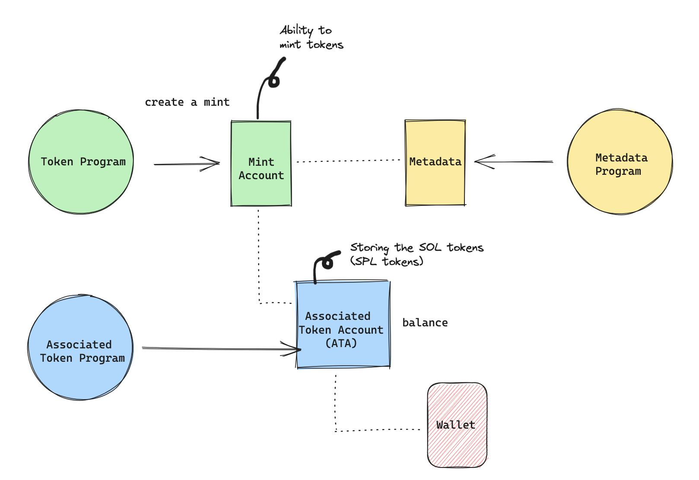

#

  

## NFT Collection

The PIRATE SHIPS NFT collection has been deployed solely for learning purposes, with [Sugar](https://docs.metaplex.com/developer-tools/sugar/), on devnet. The images of the NFTs were created using Adobe Firefly.

- [pirate-ships nft collection on candy machine](https://www.solaneyes.com/address/EMXQULormu6Q5sUv3cbqErLDKdWHiyw5zRXnQc3FAu9u?cluster=devnet)

- [prite-ships nft collection on solana explorer](https://explorer.solana.com/address/H9nM3LDbY6SJ733L6J8YWADjwRyHhA9qogqE7L3SUncQ?cluster=devnet)

## 3 separate SPL tokens

Mint address - gold: 3jaPuQ9E8B5k9aYxLRgz1vdf9erh8NzJkwrVVCrS17mv

ImageUri: https://arweave.net/QkkDm7TgTcjXVAXraUB8aAuOlX1n6ctmexdCSLqBAWA

gold Transaction completed
https://explorer.solana.com/tx/eFeBP7ZHcr1xd8gSqS7YRdxMXKNXDM3QkiwKYWj83y9Ld6jH9uTXLEKeVVMwqNwFYMhjm1vAtZRZYNtpvJSsJSz?cluster=devnet

===============================================

Mint address - rum: 3UCX3nKkbZSPGDBcwhXZBRUW8UJhL3ENTgSfihMZd7ZZ

ImageUri: https://arweave.net/xVWOdqGPKg_AAt-G2OMHDG4Ak4ugoGK_2QFRyLoPJ4Q

rum Transaction completed
https://explorer.solana.com/tx/4uETWFWoRr9LZsNNceM47hTkFj3sDeBL5ZQskcrvG3fU6fjNcjiyV3uQsvb6adVthSBWk5bnBGqnmwQ6oHCAJw74?cluster=devnet

===============================================

Mint address - cammons: GtwZo4uPxKzCUdXMZkpVHFVgZyaqkXtSqS7subbzuJ6U

ImageUri: https://arweave.net/u6QvoSb-pI3sJtRx7BZchLM4ZtcgIFFyln-_FnlryqU

cammons Transaction completed
https://explorer.solana.com/tx/PDsn6BXGHoxw2nqHUBfyKxSTsoVDDeoNMhvtctdfK2dtAfpzSqFowPzPjXMzm3SJ4354QdouN5fj9QJJmuEjhTj?cluster=devnet
