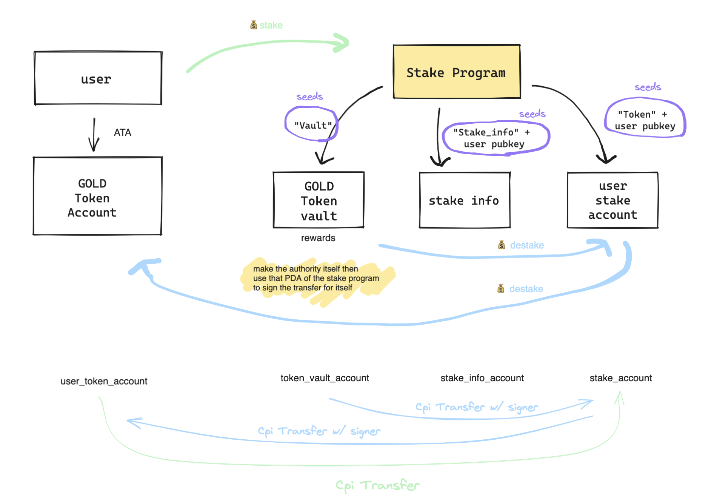

<div text-align: center>
  
</div>

# Installation

```sh
yarn add @solana/web3.js
yarn add @solana/spl-token
```

## Setup

- Cargo.toml

```toml
[dependencies]
anchor-lang = { version = "0.28.0", features = ["init-if-needed"] }
anchor-spl = "=0.28.0"
solana-program = "=1.16.7"
```

## Test

```sh
anchor test --skip-local-validator
```

> 🔔 Whenever making a transaciton on Solana, you need to make sure that you're including all the accounts required to make the transaction.

```js
// got secret key
const mintKeypair = Keypair.generate();
// use the secret key (for test propose)
const mintKeypair = Keypair.fromSecretKey(new Uint8Array[...]);
// init token mint account
const createMintToken = async () => {
  const mint = await createMint(
    connection,
    payer.payer,
    payer.publicKey,
    payer.publicKey,
    9,
    mintKeypair,
  );

  console.log(mint);
};
```

> 🚨 Error: AnchorError occurred. Error Code: DeclaredProgramIdMismatch. Error Number: 4100. Error Message: The declared program id does not match the actual program id.

```sh
# replace the declared program id in the lib.rs with this ouptput program id
solana address -k target/deploy/staking_program-keypair.json
```

> 🚨 0x1 custom program error
> https://github.com/solana-labs/solana-program-library/blob/master/token/program/src/error.rs
> reward(token_vault_account) has no tokens yet

```rust
/// Errors that may be returned by the Token program.
#[derive(Clone, Debug, Eq, Error, FromPrimitive, PartialEq)]
pub enum TokenError {
    // 0
    /// ----

    /// Insufficient funds for the operation requested.
    #[error("Insufficient funds")]
    InsufficientFunds,

    /// ----
```
